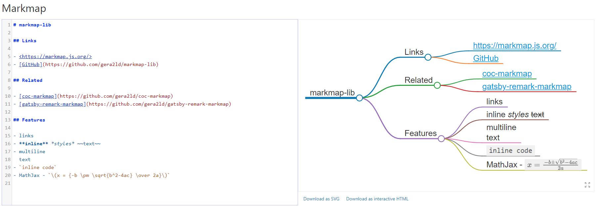

<!-- This file has been generated automatically by the following script -->
<!-- C:\Christophe\Repository\writing-documentation\concat-md\concat-md.ps1 -->
<!-- So don't modify this file manually but run the tool once more instead -->

<!-- Last refresh date: 2020-04-28 23:02:00 -->

<!-- below, content of ./index.md -->

# Markdown - tips and tools

> A few markdown tips and tools

<!-- table-of-contents - start -->
* [Tutorials](#tutorials)
* [Official logo](#official-logo)
* [Tools](#tools)
    * [markdown-link-check](#markdown-link-check)
    * [Converters](#converters)
       * [CSV to markdown](#csv-to-markdown)
       * [Google doc to markdown](#google-doc-to-markdown)
       * [HTML to markdown](#html-to-markdown)
       * [markdown to HTML](#markdown-to-html)
       * [PDF to MD](#pdf-to-md)
       * [URL to markdown](#url-to-markdown)
       * [XLS to markdown](#xls-to-markdown)
    * [Markdown-css](#markdown-css)
    * [Mermaid](#mermaid)
    * [lorem-markdownum](#lorem-markdownum)
    * [markdown-lint](#markdown-lint)
    * [Generate a mindmap from a bullet list](#generate-a-mindmap-from-a-bullet-list)
    * [Convert a folder to an HTML site](#convert-a-folder-to-an-html-site)
       * [Installation](#installation)
    * [Presentation tool (slideshows)](#presentation-tool-slideshows)
       * [Reveal-md](#reveal-md)
       * [Remark](#remark)
    * [Table generator](#table-generator)
    * [Limedocs Wiki converter](#limedocs-wiki-converter)
* [License](#license)
<!-- table-of-contents - end -->

<!-- below, content of ./010-tutorials/readme.md -->

## Tutorials

[Author guide on github](https://help.github.com/categories/writing-on-github/)

<!-- below, content of ./020-logo/readme.md -->

## Official logo

> [https://github.com/dcurtis/markdown-mark](https://github.com/dcurtis/markdown-mark)

Use this mark to identify Markdown. [https://dcurt.is/the-markdown-mark](https://dcurt.is/the-markdown-mark).

<!-- below, content of ./030-tools/readme.md -->

## Tools

<!-- below, content of ./030-tools/checks/readme.md -->

### markdown-link-check

> [https://github.com/tcort/markdown-link-check](https://github.com/tcort/markdown-link-check)

Checks that all of the hyperlinks in a markdown text to determine if they are alive or dead.

The tool has a CLI mode so it's possible to scan one file `markdown-link-check ./README.md` or an entire folder `find . -name \*.md -exec markdown-link-check {} \;` (find will search any `.md` file and run the tool for each retrieved file).

<!-- below, content of ./030-tools/converters/readme.md -->

### Converters

<!-- below, content of ./030-tools/converters/csv2md/readme.md -->

#### CSV to markdown

> [https://github.com/cavo789/marknotes_csv2md](https://github.com/cavo789/marknotes_csv2md)

CSV to markdown converter.

* [Online converter](https://csv2md.avonture.be/)

<!-- below, content of ./030-tools/converters/gd2md/readme.md -->

#### Google doc to markdown

> [https://github.com/evbacher/gd2md-html](https://github.com/evbacher/gd2md-html)

Convert a Google Doc to Markdown or HTML. This free Docs add-on converts a Google Doc to simple Markdown and/or HTML.

<!-- below, content of ./030-tools/converters/html2md/readme.md -->

#### HTML to markdown

> [https://github.com/cavo789/marknotes_html2md](https://github.com/cavo789/marknotes_html2md)

HTML to markdown converter.

* [Online converter](https://html2md.avonture.be/)

<!-- below, content of ./030-tools/converters/md2html/readme.md -->

#### markdown to HTML

> [https://github.com/cavo789/marknotes_md2html](https://github.com/cavo789/marknotes_md2html)

Markdown to HTML converter

* [Online converter](hhttps://md2html.avonture.be/)

<!-- below, content of ./030-tools/converters/pdf2md/readme.md -->

#### PDF to MD

> [https://pdf2md.morethan.io/](https://pdf2md.morethan.io/)

Online interface where we can upload a `pdf` document and receive back a markdown content. Quite good.

<!-- below, content of ./030-tools/converters/url2md/readme.md -->

#### URL to markdown

> [http://heckyesmarkdown.com/](http://heckyesmarkdown.com/)

Bookmarklet that will allow to convert a web page to a markdown document.

<!-- below, content of ./030-tools/converters/xls2md/readme.md -->

#### XLS to markdown

> [https://github.com/cavo789/marknotes_xls2md](https://github.com/cavo789/marknotes_xls2md)

 Excel to markdown converter

* [Online converter](https://xls2md.avonture.be/)

<!-- below, content of ./030-tools/css/readme.md -->

### Markdown-css

> [https://github.com/sindresorhus/github-markdown-css](https://github.com/sindresorhus/github-markdown-css)
> [https://github.com/otsaloma/markdown-css](https://github.com/otsaloma/markdown-css)

Stylesheets for Markdown to HTML conversion.

<!-- below, content of ./030-tools/diagrams_flow/readme.md -->

### Mermaid

> [https://github.com/mermaid-js/mermaid](https://github.com/mermaid-js/mermaid)

Generation of diagram and flowchart from text in a similar manner as markdown [http://mermaid-js.github.io/mermaid/](http://mermaid-js.github.io/mermaid/).

There is an online editor: [https://mermaid-js.github.io/mermaid-live-editor/](https://mermaid-js.github.io/mermaid-live-editor/).

Using the [mermaid-cli](https://github.com/mermaidjs/mermaid.cli) tool it's possible to convert a markdown file into an image so, using mermaid-cli, it's possible to write a batch script and convert flows into images at once.

Note: if you're using pandoc, there are filters: [https://github.com/raghur/mermaid-filter](https://github.com/raghur/mermaid-filter).

Demos:

* [Flow](https://mermaid-js.github.io/mermaid-live-editor/#/edit/eyJjb2RlIjoiZ3JhcGggVERcbiAgICBBW0hhcmRdIC0tPnxUZXh0fCBCKFJvdW5kKVxuICAgIEIgLS0-IEN7RGVjaXNpb259XG4gICAgQyAtLT58T25lfCBEW1Jlc3VsdCAxXVxuICAgIEMgLS0-fFR3b3wgRVtSZXN1bHQgMl0iLCJtZXJtYWlkIjp7InRoZW1lIjoiZGVmYXVsdCJ9fQ)
* [Sequence](https://mermaid-js.github.io/mermaid-live-editor/#/edit/eyJjb2RlIjoic2VxdWVuY2VEaWFncmFtXG5BbGljZS0-PkpvaG46IEhlbGxvIEpvaG4sIGhvdyBhcmUgeW91P1xubG9vcCBIZWFsdGhjaGVja1xuICAgIEpvaG4tPj5Kb2huOiBGaWdodCBhZ2FpbnN0IGh5cG9jaG9uZHJpYVxuZW5kXG5Ob3RlIHJpZ2h0IG9mIEpvaG46IFJhdGlvbmFsIHRob3VnaHRzIVxuSm9obi0tPj5BbGljZTogR3JlYXQhXG5Kb2huLT4-Qm9iOiBIb3cgYWJvdXQgeW91P1xuQm9iLS0-PkpvaG46IEpvbGx5IGdvb2QhIiwibWVybWFpZCI6eyJ0aGVtZSI6ImRlZmF1bHQifX0)
* [Gantt chart](https://mermaid-js.github.io/mermaid-live-editor/#/edit/eyJjb2RlIjoiZ2FudHRcbnNlY3Rpb24gU2VjdGlvblxuQ29tcGxldGVkIDpkb25lLCAgICBkZXMxLCAyMDE0LTAxLTA2LDIwMTQtMDEtMDhcbkFjdGl2ZSAgICAgICAgOmFjdGl2ZSwgIGRlczIsIDIwMTQtMDEtMDcsIDNkXG5QYXJhbGxlbCAxICAgOiAgICAgICAgIGRlczMsIGFmdGVyIGRlczEsIDFkXG5QYXJhbGxlbCAyICAgOiAgICAgICAgIGRlczQsIGFmdGVyIGRlczEsIDFkXG5QYXJhbGxlbCAzICAgOiAgICAgICAgIGRlczUsIGFmdGVyIGRlczMsIDFkXG5QYXJhbGxlbCA0ICAgOiAgICAgICAgIGRlczYsIGFmdGVyIGRlczQsIDFkIiwibWVybWFpZCI6eyJ0aGVtZSI6ImRlZmF1bHQifX0)
* [Class](https://mermaid-js.github.io/mermaid-live-editor/#/edit/eyJjb2RlIjoiY2xhc3NEaWFncmFtXG5DbGFzczAxIDx8LS0gQXZlcnlMb25nQ2xhc3MgOiBDb29sXG48PGludGVyZmFjZT4-IENsYXNzMDFcbkNsYXNzMDkgLS0-IEMyIDogV2hlcmUgYW0gaT9cbkNsYXNzMDkgLS0qIEMzXG5DbGFzczA5IC0tfD4gQ2xhc3MwN1xuQ2xhc3MwNyA6IGVxdWFscygpXG5DbGFzczA3IDogT2JqZWN0W10gZWxlbWVudERhdGFcbkNsYXNzMDEgOiBzaXplKClcbkNsYXNzMDEgOiBpbnQgY2hpbXBcbkNsYXNzMDEgOiBpbnQgZ29yaWxsYVxuY2xhc3MgQ2xhc3MxMCB7XG4gID4-c2VydmljZT4-XG4gIGludCBpZFxuICBzaXplKClcbn0iLCJtZXJtYWlkIjp7InRoZW1lIjoiZGVmYXVsdCJ9fQ)
* [State](https://mermaid-js.github.io/mermaid-live-editor/#/edit/eyJjb2RlIjoic3RhdGVEaWFncmFtXG4gICAgWypdIC0tPiBTdGlsbFxuICAgIFN0aWxsIC0tPiBbKl1cbiAgICBTdGlsbCAtLT4gTW92aW5nXG4gICAgTW92aW5nIC0tPiBTdGlsbFxuICAgIE1vdmluZyAtLT4gQ3Jhc2hcbiAgICBDcmFzaCAtLT4gWypdIiwibWVybWFpZCI6eyJ0aGVtZSI6ImRlZmF1bHQifX0)
* [Pie](https://mermaid-js.github.io/mermaid-live-editor/#/edit/eyJjb2RlIjoicGllXG5cIkRvZ3NcIiA6IDQyLjk2XG5cIkNhdHNcIiA6IDUwLjA1XG5cIlJhdHNcIiA6IDEwLjAxIiwibWVybWFpZCI6eyJ0aGVtZSI6ImRlZmF1bHQifX0)
* [Git](https://mermaid-js.github.io/mermaid-live-editor/#/edit/eyJjb2RlIjoiZ2l0R3JhcGg6XG5vcHRpb25zXG57XG4gICAgXCJub2RlU3BhY2luZ1wiOiAxNTAsXG4gICAgXCJub2RlUmFkaXVzXCI6IDEwXG59XG5lbmRcbmNvbW1pdFxuYnJhbmNoIG5ld2JyYW5jaFxuY2hlY2tvdXQgbmV3YnJhbmNoXG5jb21taXRcbmNvbW1pdFxuY2hlY2tvdXQgbWFzdGVyXG5jb21taXRcbmNvbW1pdFxubWVyZ2UgbmV3YnJhbmNoXG4iLCJtZXJtYWlkIjp7InRoZW1lIjoiZGVmYXVsdCJ9fQ)

<!-- below, content of ./030-tools/generator/readme.md -->

### lorem-markdownum

> [https://github.com/jaspervdj/lorem-markdownum](https://github.com/jaspervdj/lorem-markdownum)

Lorem Markdownum is a lorem ipsum generator for markdown.

* [Online tool](https://jaspervdj.be/lorem-markdownum/)

<!-- below, content of ./030-tools/lint/readme.md -->

### markdown-lint

> [https://github.com/DavidAnson/markdownlint](https://github.com/DavidAnson/markdownlint)

A Node.js style checker and lint tool for Markdown/CommonMark files.

This tool will verify the quality of any markdown files and can auto-fix some violations too.

There is an [extension for Visual Studio code](https://marketplace.visualstudio.com/items?itemName=DavidAnson.vscode-markdownlint).

<!-- below, content of ./030-tools/markmap/readme.md -->

### Generate a mindmap from a bullet list

> [https://markmap.js.org/repl](https://markmap.js.org/repl)

Write a bullet list in markdown and convert it into a `svg` file.

At this moment, it's not possible to generate an image using a CLI tool so images should be created with a screen capture program.

<!-- below, content of ./030-tools/md2html_website/readme.md -->

### Convert a folder to an HTML site

> [https://github.com/joakin/markdown-folder-to-html](https://github.com/joakin/markdown-folder-to-html)

This tool will duplicate a folder (the new folder with be prefixed by an underscore) and convert any `.md` files (whatever the folder's structure) and will convert to `.html`. The new folder will have an `index.html` page and a navigation tree so you can browse your content directly from a browser.

#### Installation

1. Run `npm install -g markdown-folder-to-html` to install the tool globally
2. Go to a folder where you've markdown files like a wiki project f.i. (let's say `c:\christophe\wiki\your-project`)
3. In the root folder run `markdown-folder-to-html .` to convert the entire folder to HTML files. You'll then get a copy into `c:\christophe\wiki\_your-project`
4. Open a browser and surf to `c:\christophe\wiki\_your-project`.

<!-- below, content of ./030-tools/presentation/readme.md -->

### Presentation tool (slideshows)

#### Reveal-md

> [https://github.com/webpro/reveal-md](https://github.com/webpro/reveal-md)

reveal.js on steroids! Get beautiful reveal.js presentations from any Markdown file

#### Remark

> [https://github.com/gnab/remark](https://github.com/gnab/remark)

A simple, in-browser, markdown-driven slideshow tool. [http://remarkjs.com](http://remarkjs.com)

<!-- below, content of ./030-tools/table-generator/readme.md -->

### Table generator

> [http://www.tablesgenerator.com/markdown_tables](http://www.tablesgenerator.com/markdown_tables)

Highlight: you can copy/paste data from Excel and this site generates the markdown rendering for this table.

<!-- below, content of ./030-tools/wiki/readme.md -->

### Limedocs Wiki converter

> [https://github.com/limedocs/limedocs-wiki-converter](https://github.com/limedocs/limedocs-wiki-converter)

Generate HTML & PDF documentation from you Github wiki or any other markdown-based wiki.

<!-- below, content of ./999-License/readme.md -->

## License

[MIT](LICENSE)
